# Hospital Management System using Java
YouHeal Hospital Management System is a desktop application built using Java to streamline hospital operations. This system ensures efficient management by providing dedicated interfaces for Admin, Doctor, Receptionist, and Patient roles. Each user needs to log in using their credentials and can recover their password if needed.

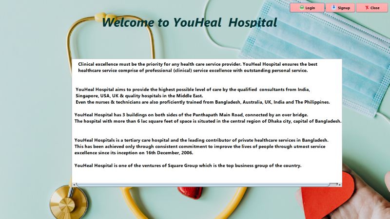

# Features
# Authentication System , Secure login for Admin, Doctor, Receptionist, and Patient Password recovery feature for users who forget their passwords.
A user can login the application using username and password.

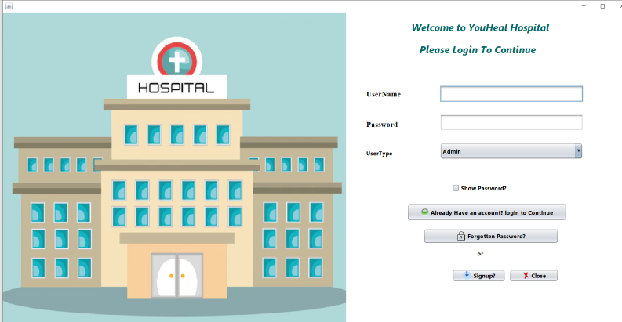

# Registration system for new users.
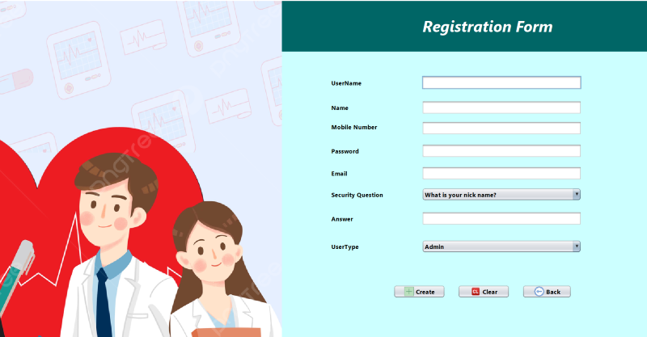

# Admin Panel
An admin can add new doctor information, new receptionist information to the hospital database. He can delete their information, update their information. He can also full history of the doctor's or receptionist's.

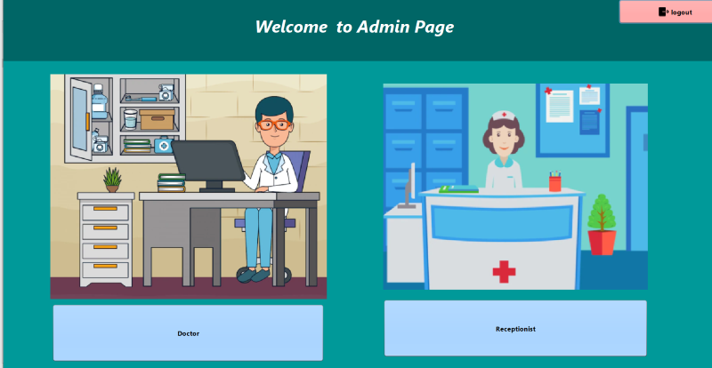

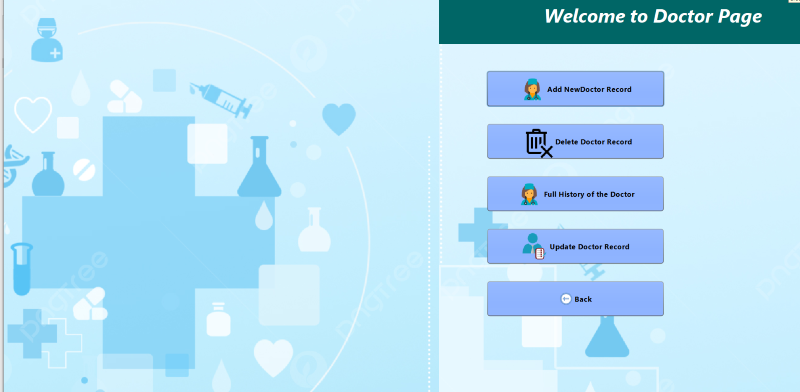

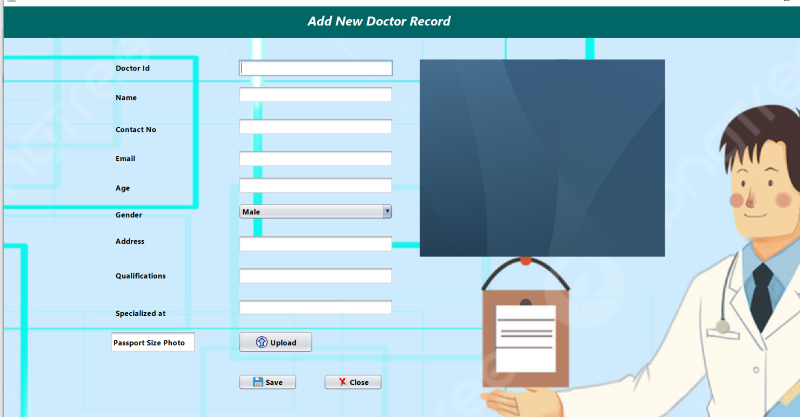

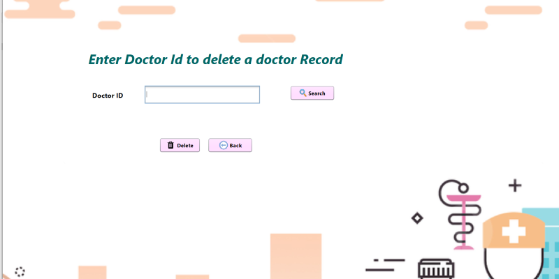

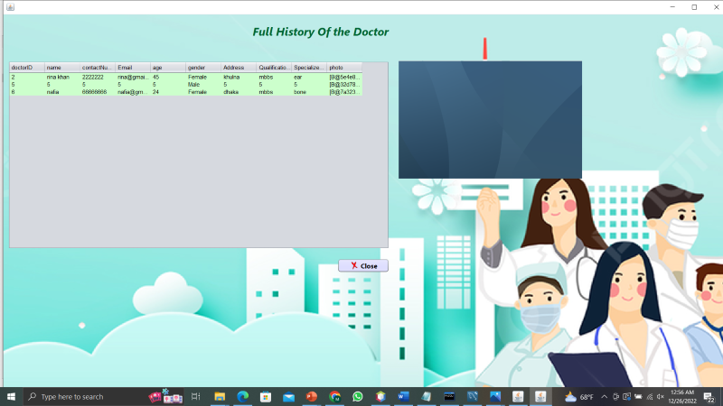

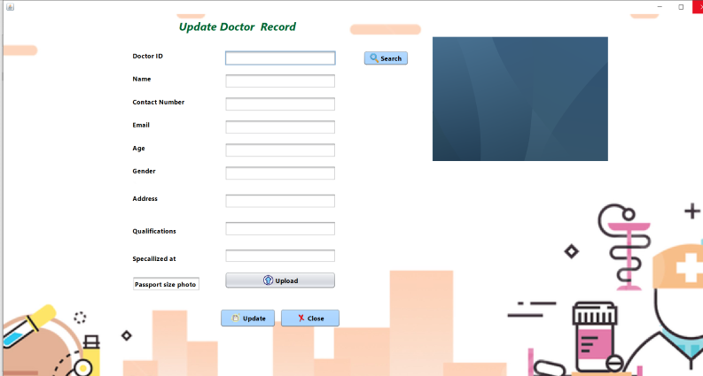

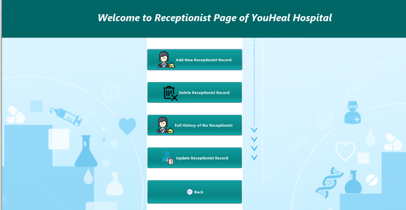

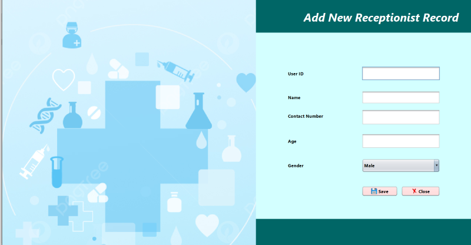

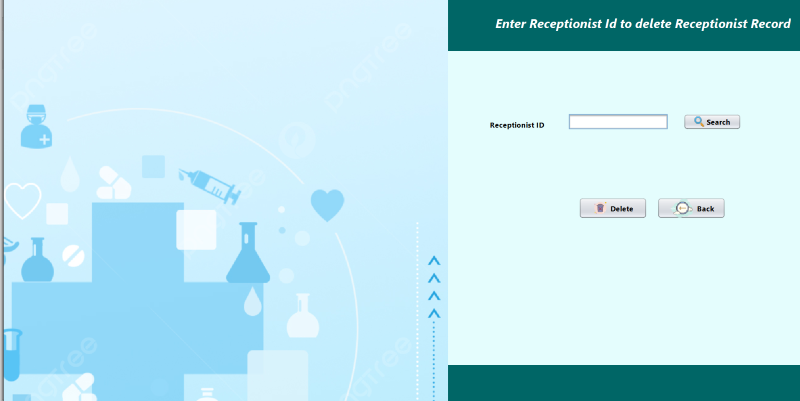

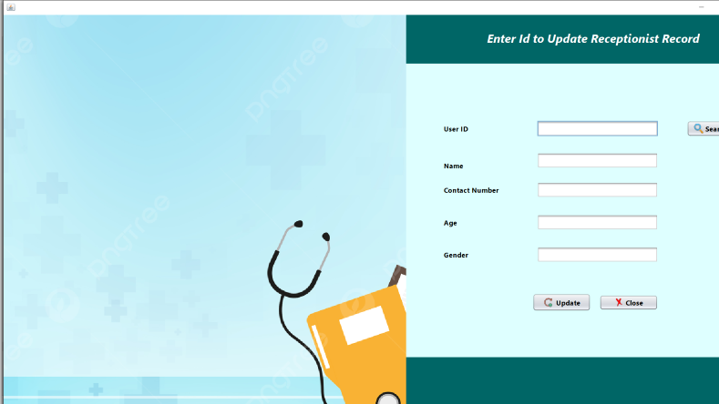

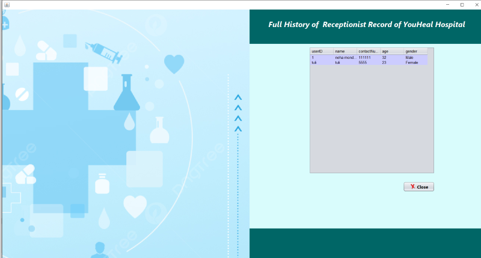

# Receptionist
A receptionist can manage patient information, ward information, leaved patient information and patient details bill.

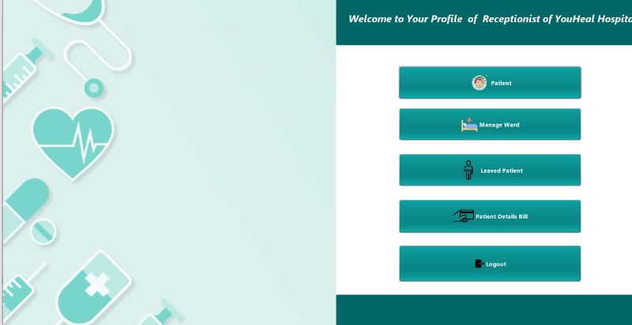

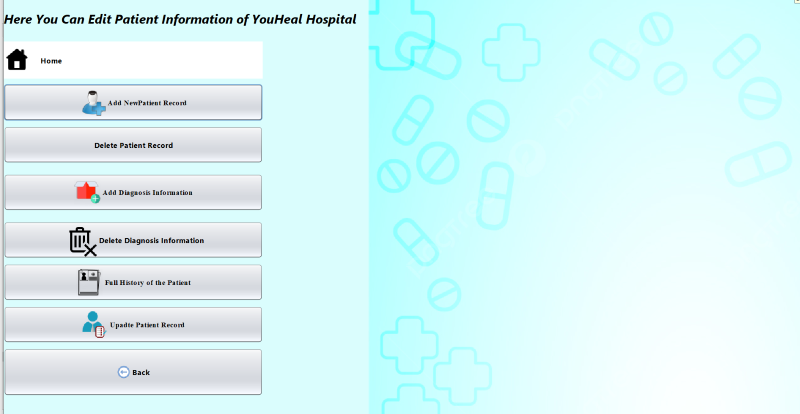

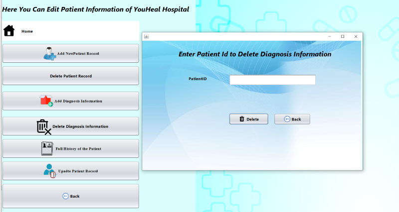

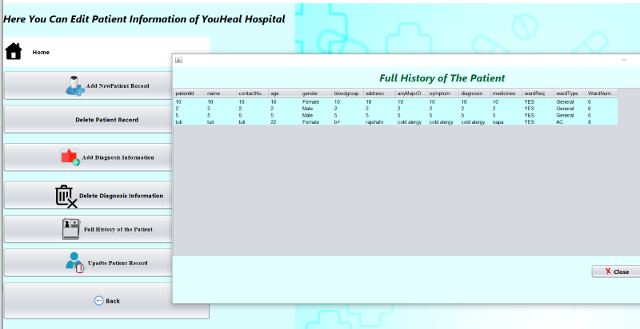

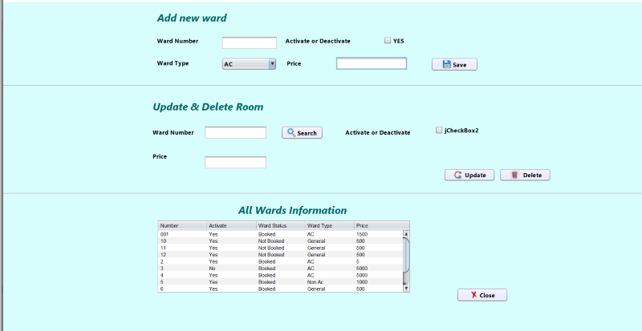

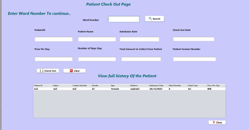

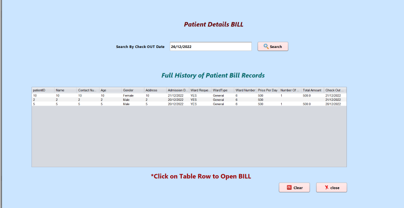

# Users profile
An user can make new appointment and can see appointment details.

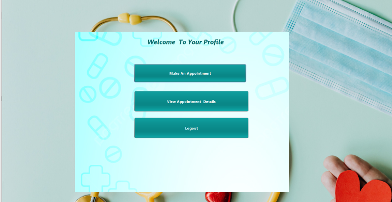

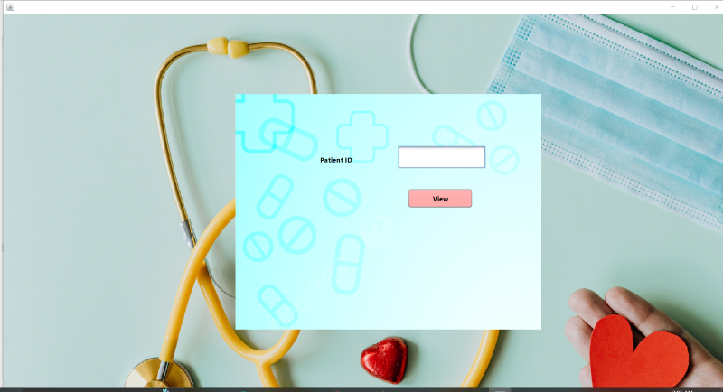

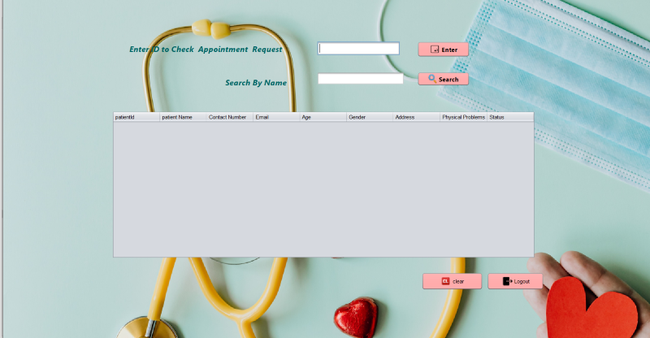

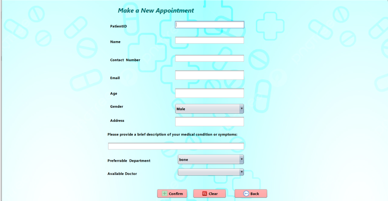

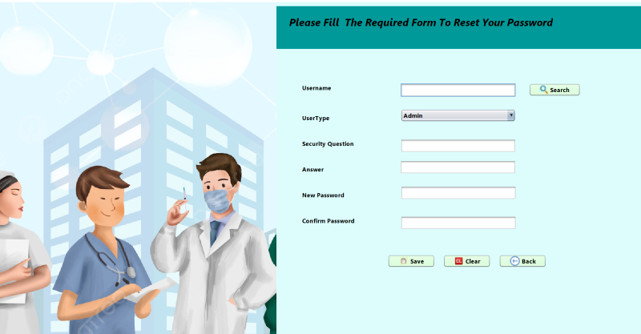

